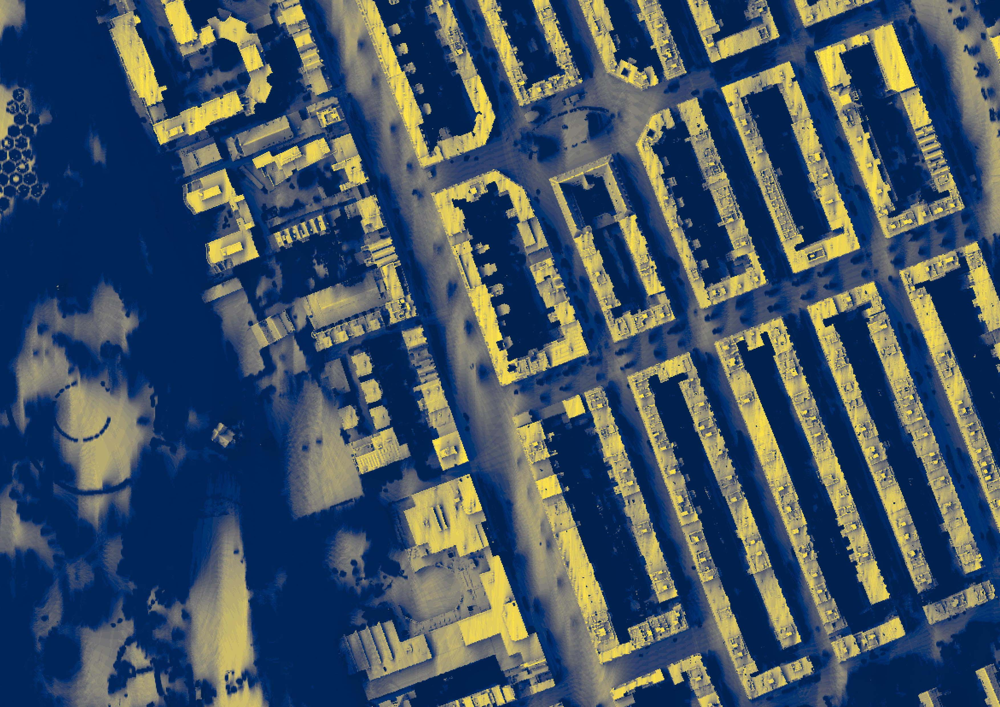

  
   

# Shady Amsterdam
This repository is created for the Synthesis course of the MSc Geomatics at TU Delft, on behalf of the clients Gemeente Amsterdam and MIT Senseable City Lab.
The datasets produced for this research can be found at: [webpage](https://doi.org/10.4121/8b65d25b-c68f-4e88-b239-27ea90eaf149.v1), the report at [webpage](https://resolver.tudelft.nl/uuid:1878b296-b888-4043-a9a6-9050ab3e5723)

The documentation can best be viewed on the [webpage](https://jsscmnhn.github.io/shady_amsterdam/).

\
The code in this repository makes it possible to create shade maps of any area in the Netherlands for any date and time,
use these shade maps and other datasets to identify and score cool spaces in the region, and to create a walkshed and
routing shady and fast routes. The repository includes three steps: calculating and creating the shade maps, identifying and scoring the cool spaces and routing. 

This repository enables the creation of shade maps for any desired region in the Netherlands at any specified date and time.
Using these shade maps alongside additional datasets, it can identify and qualify cool spaces within this region. Finally,
it can create walksheds from these cool spaces to show the shortest and the shadiest distances to these cool spaces. It
can also create shortest and/or shadiest paths to and from any given location, or the nearest cool space.

The repository is organized into three primary steps:

## 1.  Shade Map Creation (`/shade_calculation`)
This step covers the creation of the shade maps. For this, CHM and DTM files are created for the desired region. For more information about the workings of the code, look at the page:  [Shade Map Calculation](docs/Shade-Map-Calculation.md)

The code can be run separately at `/shade_calculation/main_shade.py`

## 2. Cool Spaces Creation (`/cool_place`)
This step covers the identification and qualification of cool spaces in the desired region. It requires the output shade map files of the previous step.
For more information about the workings of the code, look at the page:  [Cool Space Process](docs/Cool-Spaces.md)

The code can be run separately at `/cool_place/main.py`

## 3. Pedestrian Network Creation (`/PedestrianNetwork`)
This step covers the creation of a pedestrian network for the desired region, the creation of the walkshed and the calculation of shortest and shadiest path. It requires the ouput shade map
files of the first step, and the shade geometries of the second step. 
For more information about the workings of this code, look at the page:  [Network Process](docs/Network.md)

The code can be run separately at `/PedestrianNetwork/main_network.py`

# Running the code 
The code can be run for all steps simultaneously. For this use `main.py`, and set up the configuration files and command line arguments.

## Command Line Arguments

### --config_file_shade
- **Type**: String
- **Description**: Path to the configuration file of the shade maps. 
- **Default**: `example_run/config_files/shade_config.json`

### --config_file_cool_spaces
- **Type**: String
- **Description**: Path to the configuration file for cool spaces.
- **Default**: `example_run/config_files/coolspaceConfig.json`

### --config_file_network
- **Type**: String
- **Description**: Path to the configuration file for the pedestrian network.
- **Default**: `example_run/config_files/network_config.json`

### --run_shade
- **Type**: Boolean
- **Description**: Set to `True` to execute shade calculation; set to `False` to skip this step.
- **Default**: `True`

### --run_cool_spaces
- **Type**: Boolean
- **Description**: Set to `True` to execute cool spaces calculation; set to `False` to skip this step.
- **Default**: `True`

### --run_network
- **Type**: Boolean
- **Description**: Set to `True` to create the pedestrian network; set to `False` to skip this step.
- **Default**: `True`

## API
Find here the [API](docs/api.md)

## Configuration file 
To run the code, configuration files have to be given as input. Find out how to do this at  [Setting up the Configuration File](docs/Configuration-setup.md)

## Requirements
We provide a requirement file for both pip install and setting up a conda environment. They pip install can be found at `/requirements.txt`,
the conda environment at `/conda_environment.yml`
We recommend using a Conda environment as this simplifies installing GDAL. 

The required datasets for running the Analysis for the Amsterdam region can be found here [Datasets](https://drive.google.com/drive/folders/1LsNp03WkUEMMzGZZci4n8d7l7EE5ZUVt)

## Example run (`/example_run`)
The input, outputs and configuration file settings of an example run of a small region in Amsterdam can be found at  the directory `/example_run`.
For this, the Cool Spaces datsasets are required, found at: [Datasets](https://drive.google.com/drive/folders/1LsNp03WkUEMMzGZZci4n8d7l7EE5ZUVt)
