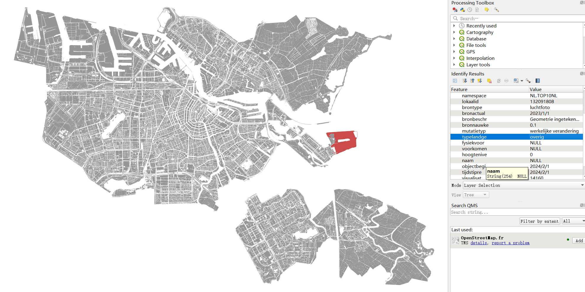
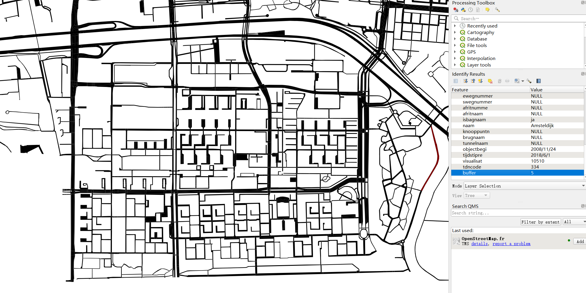
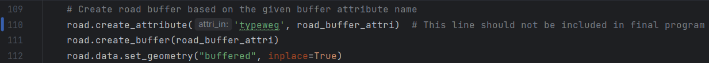
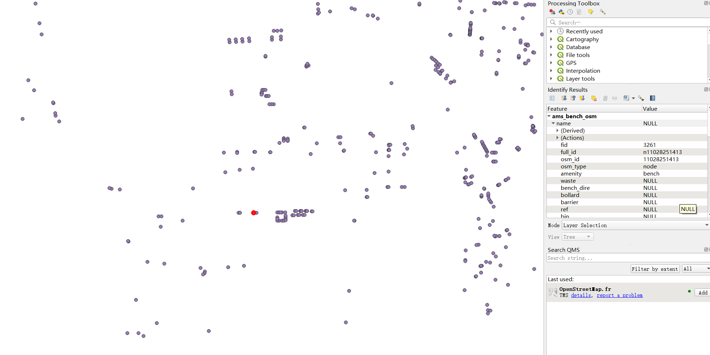
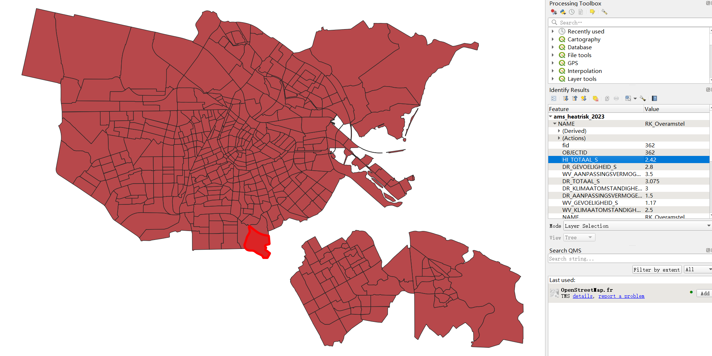
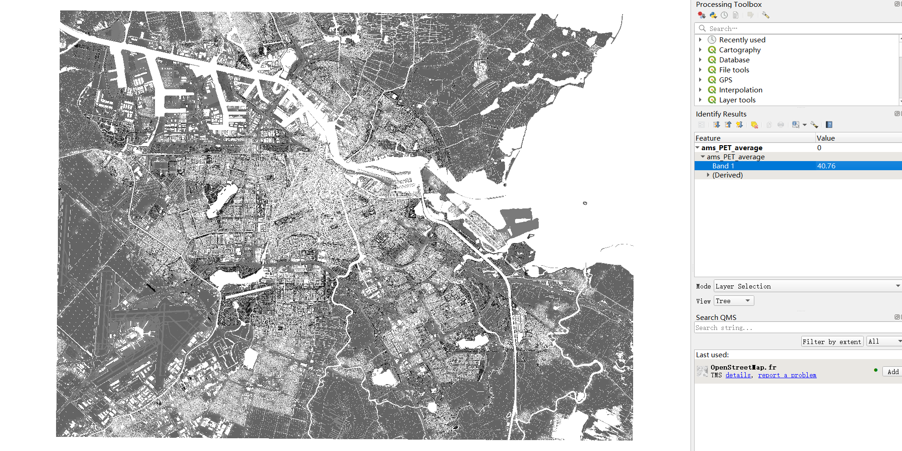
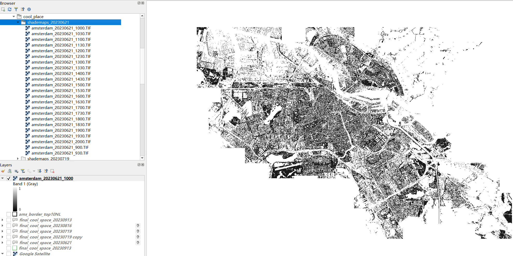
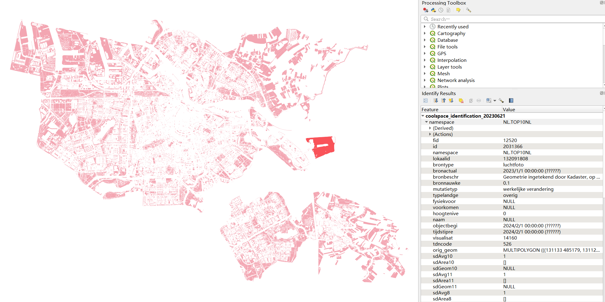
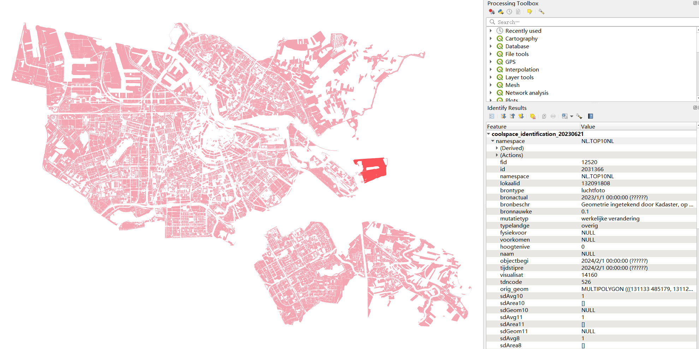

# Cool Space Process 

This documentation will explain each step involved in the cool space process, separated in two parts: identificationand evaluation.
All steps can be performed automatically by running *./cool_place/main.py* or *main.py* with a configuration
file containing the required parameters. Information about this configuration file can be found at [setting up the Configuration File](docs/Configuration-setup.md)

All data used for the cool space process must be specified by the configuration file, and all vector data should be Geopackage files (gpkg).

---
## Content

**[1. Data preparation](#heading--1)**
  * [1.1. Land use data](#heading--1-1)
  * [1.2. Road data](#heading--1-2)
  * [1.3. Building and residential data](#heading--1-3)
  * [1.4. Street furniture data](#heading--1-4)
  * [1.5. Heat risk data](#heading--1-5)
  * [1.6. PET data](#heading--1-6)
  * [1.7. shade maps data](#heading--1-7)

**[2. Identification (*identification.py*)](#heading--2)**

**[3. Evaluation (*evaluation.py*)](#heading--3)**

---

## 1. Data preparation <a name="heading--1"/>
For performing cool space process, there are eight datasets used as inputs. Six of them
are vector data, stored within one Geopackage as different layers, the two of them are
raster datasets.
### 1.1 Land use data <a name="heading--1-1"/>
The land use data are polygons with an attribute to specify different land use type, 
as shown in figure 1 below.

  
   
  <em>Figure 1: Land use data</em>

### 1.2 Road data <a name="heading--1-2"/>
The road data are polygons with an attribute specifing the buffer number of each polygon,
as shown in figure 2 below. The buffer attribute must be **numeric** attribute.

  
   
  <em>Figure 2: Road data</em>

Note: the program provided includes code to create this buffer attribute, which can only be
used for the specific road dataset we provide. For more general road data, there is one line
of the code that needs to be muted in the [*coolspace_process.py*](../cool_place/include/coolspace_process.py):

  
   
  <em>Figure 3: Code needs to be muted for more general road datasets</em>

### 1.3 Building and residential data <a name="heading--1-3"/>
For building and residential data (building population data), they can be one dataset, which are building polygons containing
an attribute of the number of residents within each building, shown in figure 4 below. Note: the attribute name **must be** `resident`

  
   
  <em>Figure 4: Building data with residents attribute</em>

In the given [*coolspaceConfig.json*](../configuration_files/coolspaceConfig.json), the building data and 
building population data are two different files, but they can be the same data. Thus simply assign the same
file name to `building_file` and `building_population_file` parameters in the config file if they are the same.

### 1.4 Street furniture data <a name="heading--1-4"/>
The street furniture data used in this project is the bench data downloaded from OpenStreetMap, which is a point 
dataset as shown in figure 5. Each point represents the location of a public bench. For the process, no attribute
is needed, only the points.

  
   
  <em>Figure 5: Bench points data</em>

### 1.5 Heat risk data <a name="heading--1-5"/>
The heat risk data are polygons of neighborhood level, containing an attribute named `HI_TOTAAL_S` which specifys 
the heat risk level of each neighborhood polygon, as shown in figure 6. Note that the program doesn't have an input
parameter allowing user to set the heat risk attribute name, which means for other heat risk datas, they also have 
to use the same attribute name `HI_TOTAAL_S`.

  
   
  <em>Figure 6: Heat risk data</em>

### 1.6 PET data <a name="heading--1-6"/>
The PET data is a raster data with one band as shown in figure 7, which is a continuous field specifying the 
Physiological Equivalent Temperature.

  
   
  <em>Figure 7: Heat risk data</em>

### 1.7 Shade maps data <a name="heading--1-7"/>
The shade maps are the output from the **Shade calculation** step, which is a folder contatining all shade maps of 
the day, from 9:00 to 20:00 as shown in figure 8. The user needs to specify the folder path in the [*coolspaceConfig.json*](../configuration_files/coolspaceConfig.json),
telling the program to read shade maps from that folder.

  
   
  <em>Figure 8: Shade maps</em>

Note that in the screenshot, the file order is not from 900 to 2000, therefore in 
[*coolspace_process.py*](../cool_place/include/coolspace_process.py), 
there is one line of code to sort the input files based on the file name:
`line 87: shadow_files.sort(key=lambda x: int(os.path.splitext(os.path.basename(x))[0].split('_')[-1]))`,
which means the suffix of shade map name has to be `_XXX`, where `XXX` represents the time. Then, 
the reading order of shade maps is correct which means the program will read from 900 to 2000, having a 
correct list order, take the screenshot as an example:
> - shademaps[0] will be *amsterdam_20230621_900*
> - shademaps[1] will be *amsterdam_20230621_930*
> - shademaps[2] will be *amsterdam_20230621_1000*
> - ...

## 2. Identification (*coolspace_process.py*) <a name="heading--2"/>
For identification, the program runs as:
> - Read road data, building data, land use data and shade maps in [*main.py of cool space*](../cool_place/main.py)
> - Call the *identification function* in [*coolspace_process.py*](../cool_place/include/coolspace_process.py)
> - The public space polygons will be created as a *GeoDataFrame* from road data, building data and land use data.
> - For each shade map, corresponding shaded area within public spaces will be extracted and evaluated, resulting in
    several new attributes stored back into the public space geodataframe, which are:
>   - `sdAvg{index}`: the average shade value of all shaded areas within a public space
>   - `sdArea{index}`: a list contains the areas of every shaded area within a public space
>   - `sdGeom{index}`: the geometry of shaded areas within a public space, either a polygon or a multi-polygon
> - After all shade maps have been processed, the shade coverage indicator will be evaluated, resulting in:
>   - `scDay` and `spDay`: daytime range shade coverage score
>   - `scMorn` and `spMorn`: morning time range shade coverage score
>   - `scAftrn` and `spAftrn`: afternoon time range shade coverage score
>   - `scLtAftrn` and `spLtAftrn` late afternoon time range shade coverage score
>   - `sc` is the score in terms of time, and `sp` is the score in terms of area ratio
> - Finally, the public space data will be output to the **INPUT** Geopackage as a new layer, which then be used as input of 
    evaluation part. By default, the public space polygons will be set as active geometry, as shown in figure 9. The user can
    change the geometry type to land use, which will result in output shown in figure 10.

---
### `OUTPUT`

  
   
  <em>Figure 9: Identification output, geometry type: public space</em>

  
   
  <em>Figure 10: Identification output, geometry type: land use</em>

