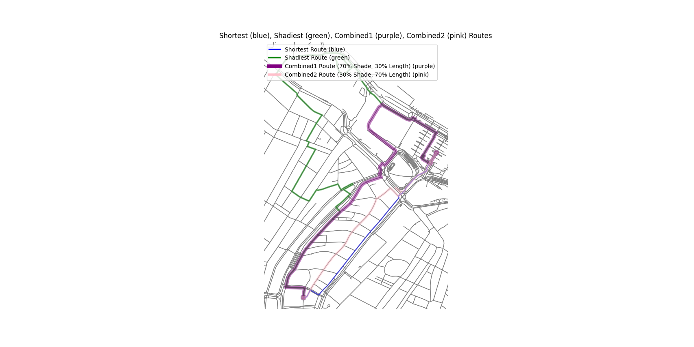

# Pedestrian Network Analysis

---

Pedestrian Network Analysis part offers a set of tools designed to identify shaded paths, locate shaded (cool) places, and map proximity to cool places around buildings.

Using these tools, users can:
- **Calculate shaded routes** between two locations or to the nearest cool place, optimizing for either distance or shade.
- **Generate a walking shed network** that classifies buildings based on their proximity to cool places, providing insights into accessible shaded zones within the city.

Each module functions independently, allowing users to perform dataset preparation, routing, or walking shed analysis based on their needs.

---
## Content

**[1. Dataset Preparation](#heading--1)**
  * [1.1. Shade Weight Calculation (*shade_weight_calculation.py*)](#heading--1-1)
  * [1.2. Cool Places Nodes Calculation (*cool_places_nodes_calculation.py*)](#heading--1-2)

**[2. Routing (*routes_calculation.py*)](#heading--2)**

**[3. Walking Shed Network (*walking_shed_network.py*)](#heading--3)**

---

## 1. Dataset Preparation <a name="heading--1"></a>

The dataset preparation phase includes calculating shade weights for pedestrian network edges and identifying nodes that could represent cool places. This provides foundational data for routing and walking shed calculations.

### 1.1 Shade Weight Calculation (*shade_weight_calculation.py*) <a name="heading--1-1"></a>

The entry function `process_multiple_shade_maps` calculates shade weights for all edges in a network based on raster shade maps.

#### Entry Function: `process_multiple_shade_maps(graph_file, raster_dir, output_dir)`
- **Parameters:**
  - `graph_file`: Path to the base network GraphML file (OSM network or pre-processed graph).
  - `raster_dir`: Directory containing raster shade maps for calculating shade weights.
  - `output_dir`: Directory where the processed GraphML files (with shade weights) will be saved.

#### How to Use:
1. Set the `graph_file` to specify the pedestrian network.
2. Provide `raster_dir` with the shade maps in `.TIF` format. The shade maps should have file names as `xxx_YYYYMMDD_HH`,such as `amsterdam_20241031_900`.
3. Specify `output_dir` to save the updated GraphML files.

Example:
```python
process_multiple_shade_maps(graph_file="path/to/network.graphml", raster_dir="path/to/shade_maps", output_dir="path/to/output")
```

While in json configuration file, for convenience, an area name could also be provided. With an area name, the program will automatically obtain OSM network of a certain area.

### 1.2 Cool Places Nodes Calculation (*cool_places_nodes_calculation.py*) <a name="heading--1-2"></a>

This module identifies and saves nodes in the pedestrian network that are closest to the bounding boxes of shaded areas, referred to as "cool places", for further use in route calculations.

#### Entry Function: `process_all_geopackages_in_directory(gpkg_directory, graph_directory, shapefile_output_directory, output_directory)`
- **Parameters:**
  - `gpkg_directory`: Directory containing GeoPackage files, each with layers representing shaded areas at specific times.
  - `graph_directory`: Directory where GraphML files with shade weights are stored.
  - `shapefile_output_directory`: Directory to export individual layers from each GeoPackage file as shapefiles.
  - `output_directory`: Directory to save files with calculated cool place nodes for each time layer.

#### How to Use:
1. Set `gpkg_directory` to the directory containing the GeoPackage files, each named to include a date, such as `shadeGeoms_YYYYMMDD.gpkg`.
2. Set `graph_directory` to the directory where shade-weighted GraphML files are located.
3. Provide `shapefile_output_directory` to specify where to save individual layers exported from each GeoPackage as shapefiles.
4. Set `output_directory` to save the resulting files containing nodes identified as cool places.

#### Example
```python
process_all_geopackages_in_directory(
    gpkg_directory="path/to/geopackage_files",
    graph_directory="path/to/graph_files_with_shade",
    shapefile_output_directory="path/to/exported_shapefiles",
    output_directory="path/to/output_cool_place_nodes"
)
```

---

## 2. Routing (*routes_calculation.py*) <a name="heading--2"></a>

The routing module provides options for calculating the shortest, shadiest, or balanced routes between two locations or to the nearest cool place. This section supports flexible routing configurations based on parameters set in the configuration.

#### Entry Function Options
The routing process determines which function to call based on the provided configuration:
- **`demo_shade_route_calculation`**: Uses specific GraphML and nodes files for direct routing.
- **`demo_shade_route_calculation_with_time`**: Searches directories to find the nearest timestamped files for time-based routing.

#### Configuration Parameters
The routing configuration parameters are as follows:

- **`graph_dir`**: Directory containing the GraphML files with shade weights (required if `graph_file` is not provided).
- **`nodes_dir`**: Directory containing files with pre-calculated cool place nodes (required if `nodes_file` is not provided).
- **`graph_file`**: Specific GraphML file with shade weights (optional).
- **`nodes_file`**: Specific file with pre-calculated cool place nodes (optional).
- **`route_option`**: Specifies routing mode, `nearest_cool_place` for routing to the nearest shaded area or `origin_destination` for routing between two points.
- **`location_indication_option`**: Specifies the type of location input, either `location_name` or `coordinates`.
- **`origin_name`**: Name of the origin location (required if `location_indication_option` is `location_name`).
- **`destination_name`**: Name of the destination location (required if `route_option` is `origin_destination` and `location_indication_option` is `location_name`).
- **`origin_latitude`** and **`origin_longitude`**: Latitude and longitude for the origin location (required if `location_indication_option` is `coordinates`).
- **`destination_latitude`** and **`destination_longitude`**: Latitude and longitude for the destination location (required if `route_option` is `origin_destination` and `location_indication_option` is `coordinates`).
- **`date_time`**: (Optional) Timestamp (`"YYYY-MM-DD HH:MM:SS"`) to select the nearest time-based files if using `demo_shade_route_calculation_with_time`.

#### How to Use:
1. Configure either `graph_file` and `nodes_file` for direct routing, or `graph_dir` and `nodes_dir` to use directory search for timestamped files.
2. Set `route_option` to define the routing mode:
   - `"nearest_cool_place"`: Calculates the path to the nearest cool place.
   - `"origin_destination"`: Routes between two specified points.
3. Set `location_indication_option` to define the location input type:
   - `"location_name"`: Uses location names for `origin_name` and `destination_name`.
   - `"coordinates"`: Uses coordinates (`origin_latitude`, `origin_longitude`, etc.).
4. Optionally, specify `date_time` if using directory-based search with `demo_shade_route_calculation_with_time`.

#### Example
Example using specified files for direct routing:
```python
routing_config = {
    "graph_file": "path/to/specific_graph.graphml",
    "nodes_file": "path/to/specific_nodes.pkl",
    "route_option": "origin_destination",
    "location_indication_option": "location_name",
    "origin_name": "Amsterdam Central Station",
    "destination_name": "Dam Square",
}
```

#### Output Example
One possible routing output example:
<p align="center">
  
  <br>
  <em>Figure 1: Routing between two locations: Amsterdam Central Station, Dam Square</em>
</p>

---

## 3. Walking Shed Network (*walking_shed_network.py*) <a name="heading--3"></a>

The walking shed network analysis categorizes buildings based on their shortest/shadiest distance from cool places, creating a "walking shed" that highlights proximity to cool places.

#### Entry Function: `walking_shed_calculation(graph, polygon_path, building_shapefile_path, weight="shade_weight", output_building_shapefile=None, output_cool_place_shapefile=None)`
- **Parameters:**
  - `graph`: Path to the GraphML file with shade weights (preprocessed network).
  - `polygon_path`: Path to polygons representing cool places (shapefile).
  - `building_shapefile_path`: Path to the shapefile containing building polygons for analysis.
  - `weight`: The edge attribute used for walking shed calculations, could be either `length` or `shade_weight`.
  - `output_building_shapefile`: (Optional) Path to save the output shapefile for buildings with assigned distance categories.
  - `output_cool_place_shapefile`: (Optional) Path to save the output shapefile for cool place nodes.

#### How to Use:
1. Set `graph` to the path of the GraphML file that has been preprocessed with shade weights.
2. Specify `polygon_path` with the shaded area polygons in shapefile format.
3. Provide `building_shapefile_path` for the buildings layer to categorize buildings by proximity to cool places.
4. Optionally, specify paths for `output_building_shapefile` and `output_cool_place_shapefile` to save results.

#### Example
```python
walking_shed_calculation(
    graph="path/to/network_with_shade.graphml",
    polygon_path="path/to/cool_places.shp",
    building_shapefile_path="path/to/buildings.shp",
    weight="shade_weight",
    output_building_shapefile="path/to/output_buildings.shp",
    output_cool_place_shapefile="path/to/output_cool_places.shp"
)
```

#### Output Example
One possible walking shed output example with `shade_weight` as `weight`:
<p align="center">
  
  <br>
  <em>Figure 2: Walking shed with `shade_weight` as `weight`</em>
</p>