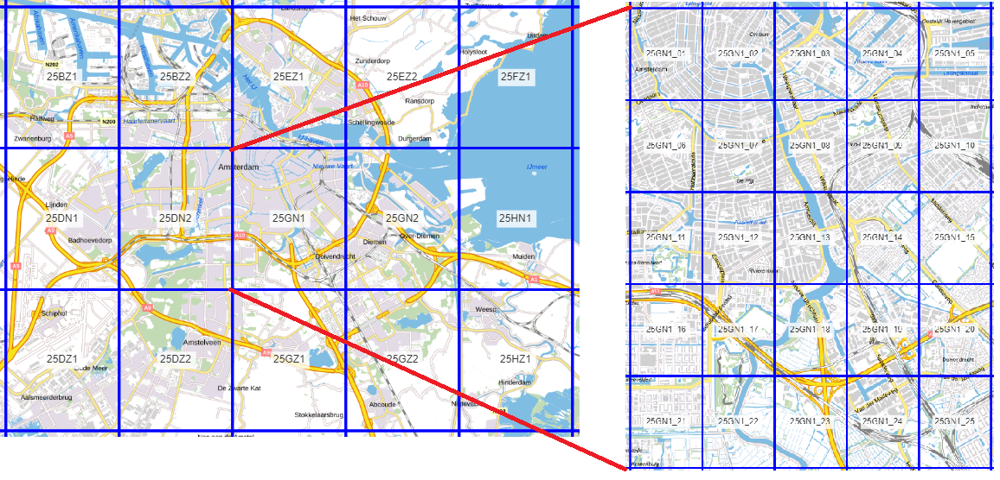
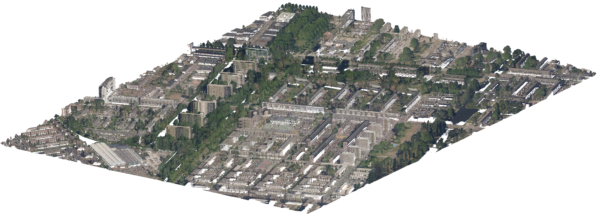
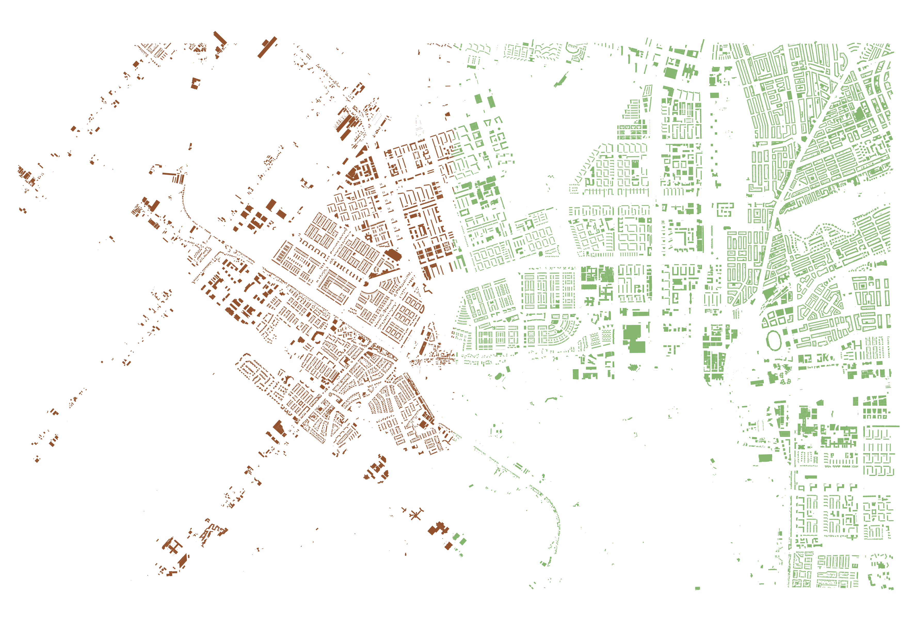
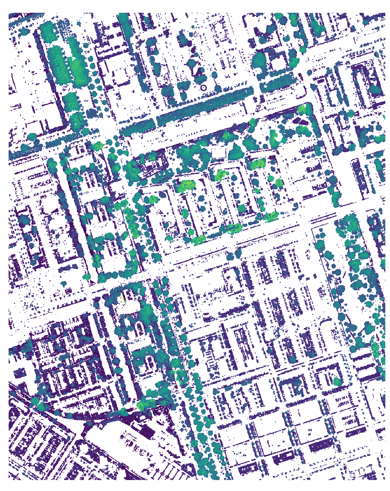
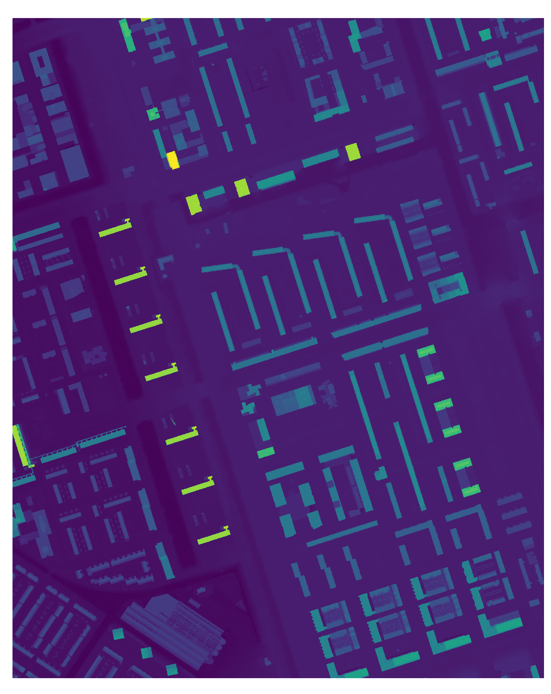
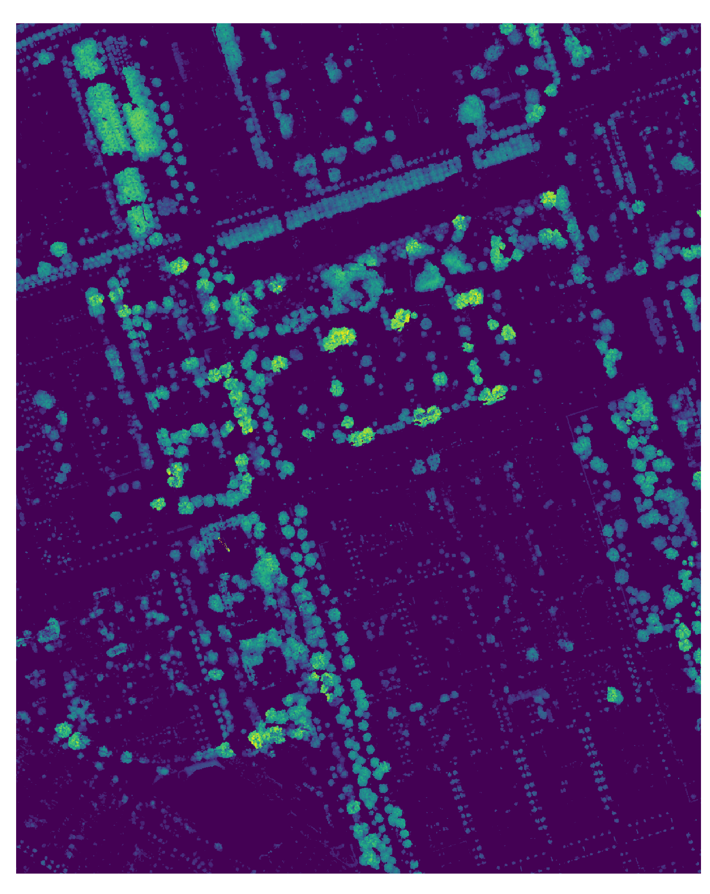
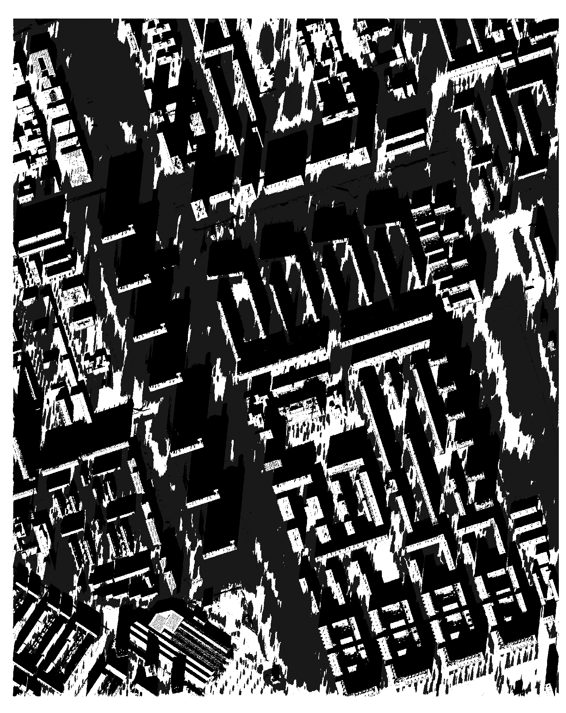
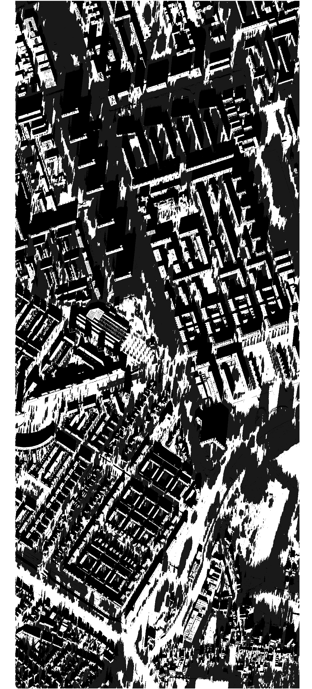

# Shade Map Calculation 

This documentation will explain each step involved in creating shade maps of an area for a given day and time frame.
All steps can be performed automatically by running *./shade_calculation/main_shade.py* or *main.py* with a configuration
file containing the required parameters. Information about this configuration file can be found at [setting up the Configuration File](docs/Configuration-setup.md)

The data used for the shade map calculation is based on AHN4, and therefore does not reflect changes in vegetation and built environment after 2020-2022.

---
## Content

**[1. Downloading the Required Data](#heading--1)**
  * [1.1. The LAZ subtiles](#heading--1-1)
  * [1.2. The DSM and DTM tiles](#heading--1-2)
  * [1.3. The building geometries](#heading--1-3)

**[2. Creating the CHM (*create_first_chm_parallel.py*)](#heading--2)**

**[3. Creating the DSM and normalized CHM (*collect_dsm_and_chm_parallel.py*)](#heading--3)**
  * [3.1. The LAZ subtiles](#heading--3-1)
  * [3.2. The DSM and DTM tiles](#heading--3-2)

**[4. Calculating the shade maps (*shade_parallel.py*)](#heading--4)**

**[5. Merging the shade ,aps (*merge_shademaps.py*)](#heading--5)**

---

## 1. Downloading the Required Data <a name="heading--1"/>
To perform the shade map calculations, we need to have a Digital Surface Model (DSM) containing the ground and building heights,
and a Canopy Height Model (CHM) containing the normalized vegetation heights.

To obtain these datasets, we need to have a DSM and DTM covering the whole area to be analyzed to create
the DSM. Thereby, we need the building geometries to extract the building heights from the DSM. Finally, we need 
the LAS data of the area to be analyzed, to extract the vegetation points. This data shall be downloaded from GeoTiles, as shown below in Figure 1. 

  
   
  <em>Figure 1: The main tiles (left) to be downloaded for the DSM and DTM, and the subtiles (right) to be downloaded for the .LAZ.</em>

### 1.1 The LAZ subtiles <a name="heading--1-1"/>
The names of the required GeoTiles subtiles have to be given in a .txt file, with each line containing a subtile to be downloaded.
With `download_las_tiles` these tiles are then downloaded from the GeoTiles website, and saved by main tile in subdirectories in the given directory. 
Note: the base download url is hard coded. This function might need to be updated in the future to retrieve new data. 

---
### `OUTPUT`
The output of this step are LAZ tiles, sorted in different directories by main tile. 

  
   
  <em>Figure 2: The .LAZ of one GeoTiles subtile.</em>

---

### 1.2 The DSM and DTM tiles <a name="heading--1-2"/>
The names of the required GeoTiles Tiles have to be given in a .txt file, with each line containing a tile to be downloaded. The DSM and
DTM of these tiles are then downloaded, and extracted as they are ZIP files, with `download_and_extract` and `download_raster_tiles`.
Note: the download url is hard coded. This function might need to be updated in the future to retrieve new data. 

Finally, the tiles are merged in a separate DTM and DSM file with `merge_tif_files`, and the original tiles are deleted.

---
### `OUTPUT`
The output of this step are two .TIFF files, one of the merged DSM and one of the merged DTM. They are saved at the given
output directory. This step also outputs a list containing the name of each main tile and the geographical bounds of this tile, to be used for the download of the building geometries. 

  
   
  <em>Figure 3: The merged DSM file, containing two GeoTiles tiles..</em>

  
   
  <em>Figure 4: The merged DTM file, containing two GeoTiles tiles.</em>

---

### 1.3 The Building Geometries <a name="heading--1-3"/>
For this step, the list of tile name and bounds of the output of `merge_tif_files` is needed. This list is used to get the name for each to be made GeoPackage layer, and the geographical bounds of the buildings to be downloaded for each layer.  The WFS url and layer name are hard coded to connect to the BAG3D dataset.
If you want to create this dataset manually, make sure the building data is saved per GeoTiles main tile in a layer together, named after the main tile. 

---
### `OUTPUT`
The output of this step is a GeoPackage, containing the building geometries of each GeoTiles main tile as a separate layer. 

  
   
  <em>Figure 5: The GeoPackage containing different layers (seen as colors) for the different GeoTiles tiles.</em>

---

## 2. Creating the CHM <a name="heading--2"/>

The LAZ tiles created with step [1.1](#heading--1-1) are transformed to CHM raster files in this step. The main directory with the subdirectories containing the LAZ subtiles is given as input in `process_laz_files`. The subtiles are all processed individually, this can be performed in parallel.
Vegetation points are extracted from the LAZ tile using AHN classification and the Normalized Difference Vegetation Index (NDVI). Optionally, low vegetation heights can be pre-filtered (`extract_vegetation_points`). The vegetation points are than transformed into a raster by inputing the points into a Delaunay Triangulation and interpolating with Laplace at the output cell raster centers within a threshold distance of a vegetation point (`interpolation_vegetation`). Finally, the output is saved to a .TIF file (`chm_creation`).
Users can choose to smooth the output chm using a median filter, by setting use_chm to true and optionally choosing a filter size. 

---
### `OUTPUT`
The output of this step are CHM files for each input subtile, stored in directories by main tile. The CHM is incomplete,
as it has not been normalized yet, contains no data values, and vegetation heights that cast ineffective shade. The
CHM file shall be updated to the final, normalized form in the next step.

  
   
  <em>Figure 6: The first CHM of a subtile.</em>

---

## 3. Creating the DSM and normalized CHM (*collect_dsm_and_chm_parallel.py*) <a name="heading--3"/>

The CHM files created with step [2](#heading--2) are used as main input for this step. They shall determine the bounds of the output normalized CHM and DSM, by cropping the merged DSM and DTM (from step [1.2](#heading--1-2)) to its extents
(`crop_raster`). 
The input for the process is the path to the directory with the subdirectories containing the CHM files (`process_folders`), the path to the merged DSM and DTM, and the building GeoPackage (step [1.3](#heading--1-3)). The processing of each input CHM file can be done in parallel.

### 3.1 The DSM with ground and building heights  <a name="heading--1-3"/>

Both the cropped DSM and DTM contain no data values that need to be filled. The raster cells are converted to points and put into a Delaunay triangulation. It is checked if the corners of the rasters contain data. If not, the nearest height value is used for these points. 
Afterward, the filled rasters are created using Laplace interpolation takes place for each raster cell (`fill_raster`). The outer row and columns are removed from the output due to possible no data values at the border.

The building geometries are used to mask the building heights from the DSM and place these into the DTM (`replace_buildings`). This final array is then saved as the DSM .TIF file for this subtile.

---
### `OUTPUT`
The output of this step are DTM files for each input CHM file, stored in directories by main tile together with the normalized CHM files. 

  
   
  <em>Figure 7: The  DSM with ground and building heights of a subtile.</em>

---

---

### 3.2 The Normalized CHM <a name="heading--3-2"/>

The filled DTM array from the previous step is used to create the normalized CHM. By removing the ground height values from the vegetation values, the actual height of the vegetation is found. The values below minimum and maximum vegetation height are also removed, to ensure effective shade and to remove high non vegetation values (`chm_finish`).

### `OUTPUT`
The output of this step are normalized CHM files for each input CHM file, stored in directories by main tile together with the DSM files.

---

  
   
  <em>Figure 8: The normalzied CHM of a subtile.</em>

---

## 4. Calculating the shade maps (*shade_parallel.py*) <a name="heading--4"/>

From the previous step, there is now a main directory, containing subdirectories named after each GeoTile main tile. Each main tile subdirectory contains the CHM and DSM files.
For this part, both the CHM and DSM have to exist for each subtile. 

In `process_folders` all CHM and DSM files are collected from the subdirectories, sorted and appended to a list. This list is used as input for the shade calculation. Users can choose the trunk height in the CHM,
the transmissivity of the canopies in the CHM, the start and end time for the calculations and the interval inbetween, the date and if they want to use the CHM (`run_shade_calculation`). The process can be performed in parallel.

---

### `OUTPUT`
The output of this step are shade maps for the input date, for the start and end time, and times inbetween set with the interval.

  
   
  <em>Figure 9: The of a subtile.</em>

## 5. Merging the shade maps (*merge_shademaps.py*) <a name="heading--5"/>
This final step covers the function `merge_tif_files_by_time`. It merges the shade maps from the previous step into single output files based on
time intervals extracted from their filenames. The function processes each subfolder to collect TIFF files within a specified time range and 
creates a mosaic by reading and merging the data. On overlapping regions with data values, the lowest value is chosen.
The original files can optionally be deleted.

### `OUTPUT`
The output of this step are merged shade maps of the individual shade maps of the previous step, merged by time.

  
   
  <em>Figure 10: The merged shademap of the desired area (2 subtiles).</em>

